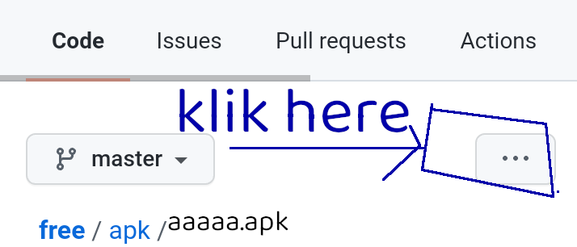
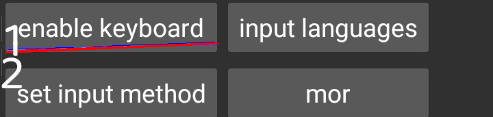
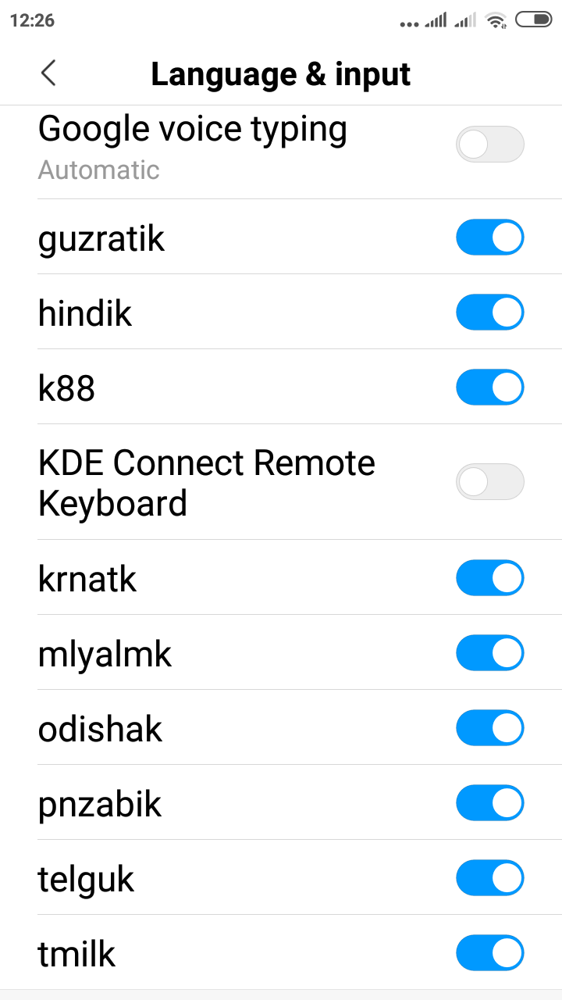
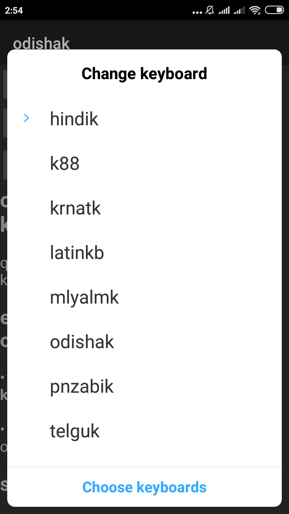

## **1) go up n klik hindik.apk or markor.apk**

-----------------------

## **2) klik 3 dots ...**

----------------------

## **3) klik blue Dounload button ...**

----------------------

## **4) enable hindik and set hindik**

----------------------

## **5) enable hindik**

-----------------------

## **6) set hindik**

------------------------

## **7) [video1 for hindik.apk markor.apk](https://www.youtube.com/watch?v=FiVM3Vl6UPU)**

------------------------

### videos to dounload install use markor.apk n hindik.apk
1. [video9][vid9]
1. [video8][vid8]
1. [video7][vid7]
2. [video6][vid6]
2. [video5][vid5]
2. [video4][vid4]
2. [video3][vid3]
2. [video2][vid2]
2. [video1][vid1]

--------------------

[vid1]: https://youtu.be/U3n9kE2OqR4
[vid2]: https://youtu.be/bcMRr-lntxI
[vid3]: https://youtu.be/F_wrPdnQAhM
[vid4]: https://youtu.be/fnIx1Pz2bLg
[vid5]: https://youtu.be/4kExRfkS9cw
[vid6]: https://youtu.be/Sq-qX8P0QhA
[vid7]: https://youtu.be/qoBTwix8w8k
[vid8]: https://youtu.be/4yM6iTyDNZk
[vid9]: https://youtu.be/BgyJ-XWmyqw

-----------------
