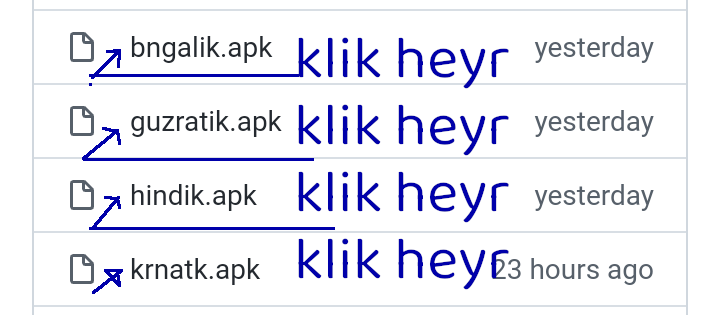
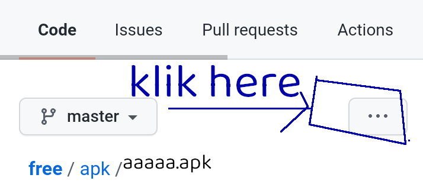
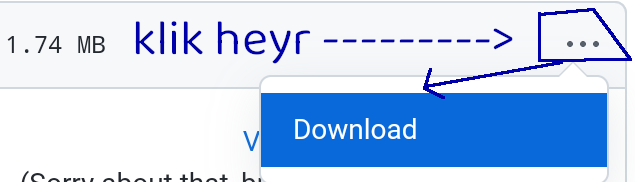
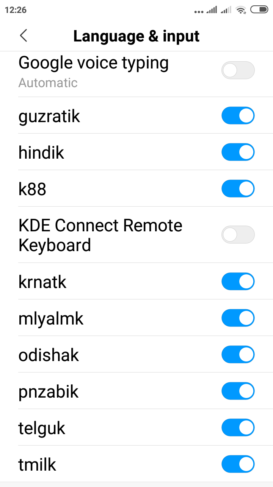
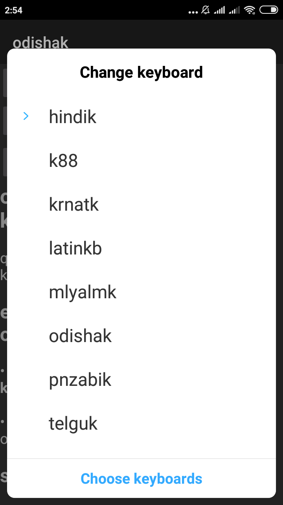

## **1) go up n klik hindik.apk or markor.apk**

-----------------------

## **2) klik 3 dots ...**

----------------------

## **3) klik blue Dounload button ...**

----------------------

## **4) enable hindik**

-----------------------

## **5) set hindik**

------------------------

## ** 6) [video1 for hindik.apk markor.apk](https://www.youtube.com/watch?v=FiVM3Vl6UPU)**

------------------------
