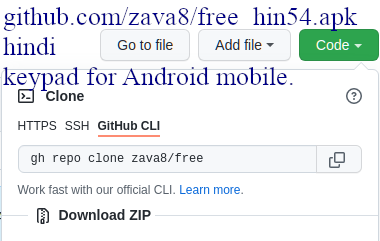
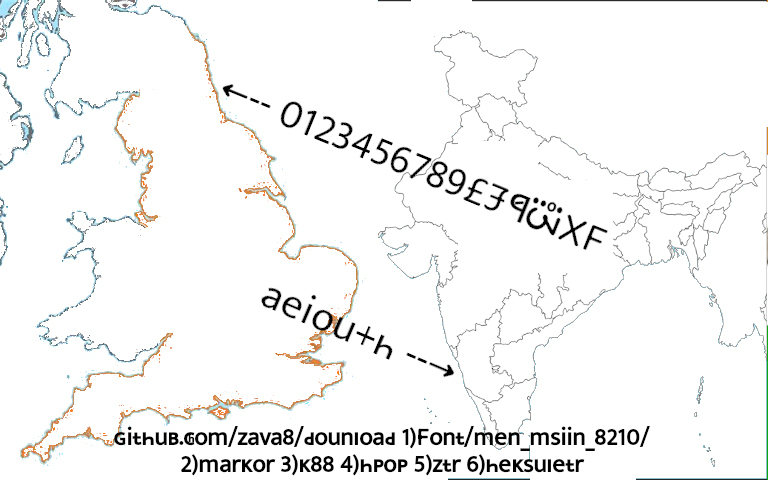

indian languages fonts:
1. tmil54.ttf
2. hin54.ttf
3. mlyalm54.ttf
4. knrra54.ttf
5. guz54.ttf
6. uria54.ttf
7. gurum54.ttf
8. telgu54.ttf
9. bangla54.ttf

#### font install steps :

1. font install ke liye [ZFONt 3](https://play.google.com/store/apps/details?id=com.htetznaing.zfont2&hl=en_US&gl=US) app google play store se install kre.
2. HTTP://GITHUB.COM/Zava8 pr zakr **Free (public)** repo link pr klik kre.
3. Ab **green klr ke"COde"** btn Dbaye.
4. "Download button" touch kre.
5. klik on **"..."**  button on RIGHT side
6. phir **Dounload** btn klik kre , zisse hin54.ttf download ho zaega.
7. hin54.ttf  ko **"ZFONt 3"** ke saTh khole.

sare steps ke liye niche vale video ko viyu kre. 
1. [zfont3 app install from playstore](https://www.youtube.com/watch?v=bcMRr-lntxI&list=PLlYCdgTLt8n_IAHUukeGxrD9ebYAmnevQ)
1. [github.com/zava8/free se hin54.ttf  kre Aur zfont 3 se install  kre](https://www.youtube.com/watch?v=U3n9kE2OqR4)
1. [github.com/zava8/free se hin54.ttf  kre Aur zfont 3 se install  kre](https://www.youtube.com/watch?v=bcMRr-lntxI)
1. [hin54.ttf  se phone me like](https://www.youtube.com/watch?v=BgyJ-XWmyqw&list=PLlYCdgTLt8n-CcTg13Ul9VLMY4pQDUJ6m)


```
hin54.ttf 2in1 hindi+latin_abc font h.
A B C D E F G H I J K L M N O P Q R S T U V W X Y Z
a b c d e f g h i j k l m n o p q r s t u v w x y z
```
iska ascii code map ki imez niche h.
1. 
1. 
1. 

hin54 ke Akzampls :
1. 
1. 
1. 
