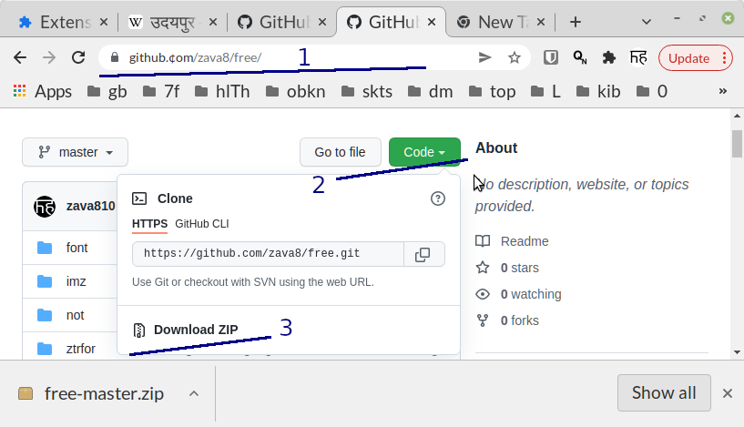
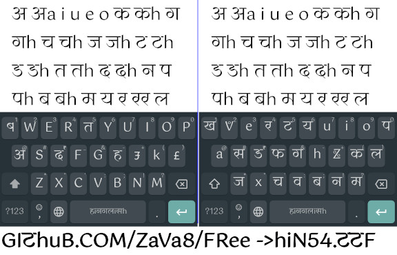

## 1) [open apk foldr](./apk)

--------------------

### videos to dounload install use markor.apk n hindik.apk

1. [video7][vid7]
2. [video6][vid6]
2. [video5][vid5]
2. [video4][vid4]
2. [video3][vid3]
2. [video2][vid2]
2. [video1][vid1]

--------------------

1. laptop/pc free repo daunload zip. unzip -> save in some folder (unzip kro , kisi folder me sev kro)

-------------------

[github.com/zava8/free se hin54.ttf  kre Aur zfont 3 se install  kre][vid6]

-------------------

-----------------

[vid1]: https://youtu.be/U3n9kE2OqR4
[vid2]: https://youtu.be/bcMRr-lntxI
[vid3]: https://youtu.be/F_wrPdnQAhM
[vid4]: https://youtu.be/fnIx1Pz2bLg
[vid5]: https://youtu.be/4kExRfkS9cw
[vid6]: https://youtu.be/Sq-qX8P0QhA
[vid7]: https://youtu.be/qoBTwix8w8k

----------
#india #national vowels aeiou+h
#hindi n #Scots  2in1 #LanguageLearning #language #langchat #languages #fonts #TypeScript #typography  hin54.ttf   
@EkTypeFoundry @FontForge
 #HindiNews #multilingual #hindiisnottheonlynationallanguageofindia

